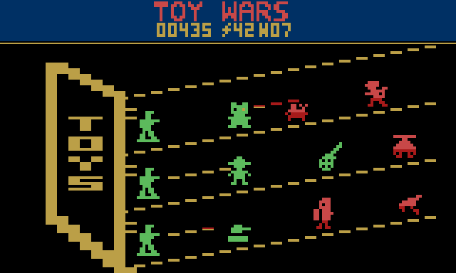

# Toy Wars

An original lane-defense game for the Atari 2600, in the spirit of Plants vs.
Zombies: toys on a shelf hold off monsters marching in from the right.
16K cartridge (F6 bank switching) with Atari's Super Chip (128 bytes of
cartridge RAM), NTSC.

**Play it in your browser:** https://plicerin.github.io/toywars/




## How to play

Defend the toy box on the left. Monsters walk in along the three shelves;
place toys in the nine slots (three per shelf) to stop them.

- **Joystick / arrow keys:** move the cursor over the slots. An empty slot
  shows a blinking ghost of the toy you're about to place.
- **Fire / Space:** place that toy (it costs batteries), or pick up the toy
  under the cursor (half its cost back).
- **Hold fire + left/right:** choose a different toy.
- **Game Reset / Enter:** new game. Fire also starts one.
- **Game Select / G:** choose game 1, 2 or 3 (starting at wave 1, 5 or 9, with
  30, 50 or 70 batteries); pressed during a game, it goes back to choosing.
- **Left difficulty A:** monsters arrive more often from the start (three quarters of the gap); in the second lap, five eighths and every monster one health tougher.

Batteries (the big green number) trickle in and every monster you
destroy pays some. The first monster that reaches the box slams that shelf's
lid and clears it; the second one through the same shelf ends the game.

Toys unlock wave by wave: army man (shoots), teddy (soaks up bites), tank
(one heavy shell), cowboy (lassos a monster in place), cannon (cannonballs that
splash monsters bunched together),
jet (takes off from the toy box end and flies its whole shelf, hitting every monster it passes, once). Monsters arrive wave by wave too:
dino, wind-up mice (in packs of three), crawler (army bullets pass over it
while it chews), knight (charges once its shield breaks), helicopter (hops
over the first toy), balloon clown (floats over every toy; tank shells can't
reach it), pogo frog (jumps to the next shelf once), and the T-Rex boss of
waves 6 and 12 (crushes a toy in one bite). Every fourth wave they get
tougher (mice and balloon clowns every eighth); after wave 12 the waves
repeat, faster.

## Status

Playable: placing toys, batteries, the six toys, all eight monsters, waves
with unlocks and boss waves, lid slams, game over, sound effects (TIA: your
actions and the jingles on one channel, the fighting on the other), music (a
toy march: melody and bass before a game, the melody softly during play),
Game Select and the difficulty switch. See [DESIGN.md](DESIGN.md) for the design.

How the screen is drawn:

- Three slanted shelves drawn by the ball, moved six pixels left every row
  with HMOVE.
- The toy box: playfield 1, cleared mid-line so its reflected copy never
  shows.
- Toys on a 3 × 3 grid: player 0 as three copies 32 pixels apart, its
  graphics rewritten between the copies, so the toys never flicker.
- Monsters: player 1, moved from monster to monster down the screen by an
  event queue built each frame (PLA pulls the data, RTS jumps into one of
  eight code variants that strobe RESP1 on a fixed cycle). Monsters that
  share lines take turns; no monster goes more than six frames undrawn.
  Each picks its color through the queue.
- Shots: missile 1, one per shelf.
- Header: 48-pixel text (title or GAME OVER), then the status line: score and
  wave as 40-pixel text, and the batteries as big green playfield digits.

## Files

- `toywars.asm` — the game (DASM). `toywars.bin` is the assembled cartridge.
- `tools/gen.mjs` — generates the graphics, tables and the cycle-timed event
  code (`gen/`) that the assembly includes.
- `tools/build.ps1` — runs the generator and DASM (put `dasm.exe` and `vcs.h`
  in `tools/dasm/`).
- `toywars.asm` holds the frame loop, header and screen kernel; `logic.asm`
  (bank 2) is the game; `sound.asm` (bank 3) plays the sound effects and
  music.
- `tools/test.mjs` — runs the cartridge on the 6502 core and TIA model in
  `src/`: frame timing (262 lines) through 20,000 frames of random play and a
  late-game stress test, every visible pixel against `tools/expect.mjs` (a
  reference picture drawn from the game state), the rules scenario by
  scenario, booting from each bank, and correct Super Chip use.
- `tools/bot.mjs` — a player that uses only the joystick; reports how far it
  gets (it reaches waves 12-18).
- `src/` — the emulator core used by the tests and the web page (6502, TIA,
  RIOT, F8/F6 bank switching, Super Chip).

```
node tools/test.mjs
```

The cartridge also runs in Stella (it detects F6 with Super Chip from the
image).
