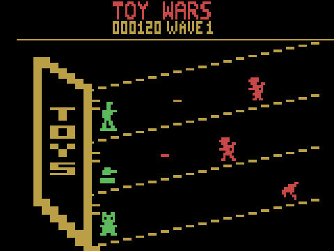

# Toy Wars

An original lane-defense game for the Atari 2600, in the spirit of Plants vs.
Zombies: toys on a shelf hold off monsters marching in from the right.
16K cartridge (F6 bank switching) with Atari's Super Chip (128 bytes of
cartridge RAM), NTSC.

**Play the current build in your browser:** https://plicerin.github.io/toywars/



## Status

Milestone 1 — the play screen, with demo motion (enemies walk in, shots fly;
there is no gameplay yet). The design for the full game is in
[DESIGN.md](DESIGN.md).

- Three slanted shelves drawn by the ball, moved six pixels left every row
  with HMOVE.
- The toy box: playfield 1, cleared mid-line so its reflected copy never
  shows.
- Toys on a 3 × 3 grid: player 0 as three copies 32 pixels apart, its
  graphics rewritten between the copies, so the toys never flicker.
- Enemies: player 1, moved from enemy to enemy down the screen by an event
  queue built each frame (PLA pulls the data, RTS jumps into one of eight
  code variants that strobe RESP1 on a fixed cycle). Enemies that share lines
  take turns; the start of the rotation moves every frame, so no enemy goes
  more than six frames undrawn. Two walking frames each.
- Shots: missile 1, one per shelf.
- Header: 48-pixel text (title, then score and wave).

## Files

- `toywars.asm` — the game (DASM). `toywars.bin` is the assembled cartridge.
- `tools/gen.mjs` — generates the graphics, tables and the cycle-timed event
  code (`gen/`) that the assembly includes.
- `tools/build.ps1` — runs the generator and DASM (put `dasm.exe` and `vcs.h`
  in `tools/dasm/`).
- `tools/test.mjs` — runs the cartridge on the 6502 core and TIA model in
  `src/` and checks it against `tools/expect.mjs`, a reference picture drawn
  straight from the design: frame timing (262 lines), every visible pixel of
  the scene, 300 random scenes, 1,200 frames of motion, booting from each
  bank, and correct Super Chip use.
- `src/` — the emulator core used by the tests and the web page (6502, TIA,
  RIOT, F8/F6 bank switching, Super Chip).

```
node tools/test.mjs
```

The cartridge also runs in Stella (it detects F6 with Super Chip from the
image).
